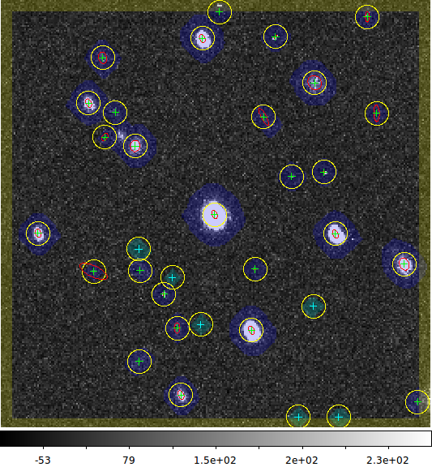

.. currentmodule:: lsst.meas.base
.. lsst-task-topic:: lsst.meas.base.sfm.SingleFrameMeasurementTask

##########################
SingleFrameMeasurementTask
##########################

``SingleFrameMeasurementTask`` runs a set of (user-selectable) plugins, implementing particular measurement algorithms, to measure the properties of sources on a single image.

Processing Summary
==================

The set of plugins to run is set in the task configuration.
Each plugin defines the values that it measures (which correspond to columns in the output table), and then conducts measurement on each detected source.
See `SingleFramePlugin` for details.
This task intializes the set of plugins (thereby defining the catalog schema) from its configuration, then invokes each plugin on each source.

When run after the deblender (see :lsst-task:`lsst.meas.deblender.SourceDeblendTask`), this task also replaces each source's neighbors with noise before measuring each source, utilizing the heavy `~lsst.afw.detection.Footprint`\s created during deblending (see `NoiseReplacer`).

.. _lsst.meas.base.sfm.SingleFrameMeasurementTask-api:

Python API summary
==================

.. lsst-task-api-summary:: lsst.meas.base.sfm.SingleFrameMeasurementTask

.. _lsst.meas.base.sfm.SingleFrameMeasurementTask-configs:

Configuration fields
====================

.. lsst-task-config-fields:: lsst.meas.base.sfm.SingleFrameMeasurementTask

.. _lsst.meas.base.sfm.SingleFrameMeasurementTask-examples:

Examples
========

Refer to :file:`examples/runSingleFrameTask.py` for a complete, executable version of this example: the below presents only the key logic.

First, import the required tasks:

.. code-block:: py

   from lsst.meas.algorithms.detection import SourceDetectionTask
   from lsst.meas.base import SingleFrameMeasurementTask

We need to create our tasks before processing any data as the task constructors can add extra columns to the schema.
The most important argument we pass these to these is an `lsst.afw.table.Schema` object, which contains information about the fields (i.e. columns) of the measurement catalog we'll create, including names, types, and additional documentation.
Tasks that operate on a catalog are typically passed a schema upon construction, to which they add the fields they'll fill later when run.
We construct a mostly empty schema that contains just the fields required for a `lsst.afw.table.SourceCatalog` like this:

.. code-block:: py

   schema = afwTable.SourceTable.makeMinimalSchema()

Now we can configure and create the :lsst-task:`lsst.meas.algorithms.detection.SourceDetectionTask`:

.. code-block:: py

   # Create the detection task
   #
   config = SourceDetectionTask.ConfigClass()
   config.thresholdPolarity = "both"
   config.background.isNanSafe = True
   config.thresholdValue = 3
   detectionTask = SourceDetectionTask(config=config, schema=schema)

We then move on to configuring the measurement task:

.. code-block:: py

   config = SingleFrameMeasurementTask.ConfigClass()

While a reasonable set of plugins is configured by default, we'll customize the list.
We also need to unset one of the slots at the same time, because we're not running the algorithm that it's set to by default, and that would cause problems later:

.. code-block:: py

   config.plugins.names.clear()
   for plugin in ["base_SdssCentroid", "base_SdssShape",
                  "base_CircularApertureFlux", "base_GaussianFlux"]:
       config.plugins.names.add(plugin)
       config.slots.psfFlux = None

Now, finally, we can construct the measurement task:

.. code-block:: py

   measureTask = SingleFrameMeasurementTask(schema, config=config)

After constructing all the tasks, we can inspect the Schema we've created:

.. code-block:: py

   print(schema)

All of the fields in the schema can be accessed via the ``get`` method on a record object.
See `lsst.afw.table` for more information.

We're now ready to process the data (we could loop over multiple exposures/catalogs using the same task objects).
First create the output table and process the image to find sources:

.. code-block:: py

    tab = afwTable.SourceTable.make(schema)
    sources = result.sources

Then measure them:

.. code-block:: py

    measureTask.run(sources, exposure)

We then might plot the results (e.g. if you set ``--doDisplay`` on the command line)

.. code-block:: py

    if display:
        # display image (see also --debug argparse option)
        frame = 1
        disp = afwDisplay.Display(frame=frame)
        disp.mtv(exposure)

        with disp.Buffering():
            for s in sources:
                xy = s.getCentroid()
                disp.dot('+', *xy, ctype=afwDisplay.CYAN if s.get("flags_negative") else afwDisplay.GREEN)
                disp.dot(s.getShape(), *xy, ctype=afwDisplay.RED)

and end up with something like

